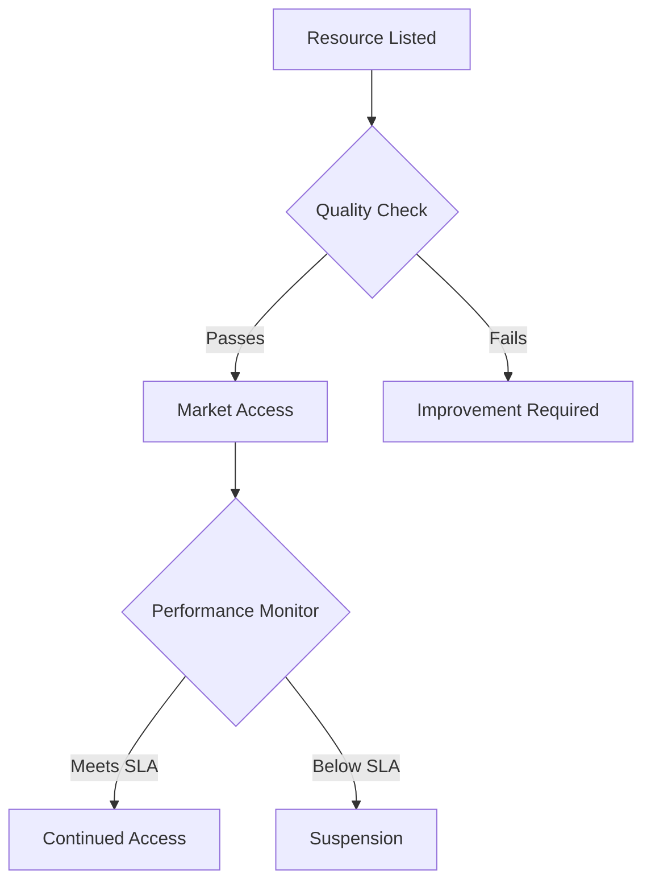

# Quantum-Classical Hybrid Computing Marketplace (QCHM)

## System Architecture

A decentralized platform enabling seamless integration and trading of quantum and classical computing resources with automated optimization.

### Core Components

#### 1. Resource Management System
```
├── Compute Resources
│   ├── Quantum Processors
│   │   ├── Gate-based Systems
│   │   └── Quantum Annealers
│   └── Classical Systems
│       ├── CPU Clusters
│       └── GPU Arrays
└── Integration Layer
    ├── Task Scheduler
    └── Resource Optimizer
```

#### 2. Smart Contract Framework
```solidity
contract ComputeMarket {
    struct Resource {
        uint256 resourceId;
        ResourceType resourceType;
        uint256 capacity;
        address provider;
        uint256 price;
        bool available;
    }
    
    struct ComputeTask {
        uint256 taskId;
        bytes32 algorithmHash;
        uint32 complexity;
        ResourceType[] requiredResources;
        bool completed;
    }
    
    enum ResourceType { QUANTUM_GATE, QUANTUM_ANNEALING, CPU, GPU, HYBRID }
    
    mapping(uint256 => Resource) public resources;
    mapping(uint256 => ComputeTask) public tasks;
}
```

### Task Distribution System

#### 1. Workload Analysis
- Complexity assessment
- Resource requirements
- Optimization opportunities

#### 2. Resource Allocation
```
Allocation Score = (Task Fit * Resource Efficiency) / Cost
Optimization Factor = ∑(Quantum Advantage * Classical Support) / Time
```

### Technical Implementation

#### Resource Integration
1. Interface Standards
    - Quantum instruction sets
    - Classical APIs
    - Hybrid protocols

2. Execution Pipeline
    - Task decomposition
    - Resource scheduling
    - Result aggregation

#### Market Infrastructure
```
├── Trading System
│   ├── Order Matching
│   ├── Price Discovery
│   └── Settlement
├── Quality Control
│   ├── Performance Monitoring
│   └── Result Validation
└── Billing
    ├── Usage Tracking
    └── Payment Processing
```

### Governance Framework

#### Resource Standards
1. Provider Requirements
    - Hardware specifications
    - Uptime guarantees
    - Performance metrics

2. Quality Assurance
    - Regular benchmarking
    - Error rate monitoring
    - Result verification

#### Market Rules


### Economic Model

#### Token Utility
- QCOM (Quantum Compute) governance token
- Resource credits
- Quality stakes

#### Pricing Mechanism
```
Resource Price = Base Rate * (Quality Score + Availability Factor)
Task Cost = Resource Usage * Complexity Factor * Time Unit
```

### Quality Control

#### Performance Metrics
1. Resource Quality
    - Quantum coherence time
    - Gate fidelity
    - Classical performance
    - Network latency

2. Task Execution
    - Completion time
    - Error rates
    - Resource efficiency

### Security Measures

#### 1. Access Control
- Multi-factor authentication
- Role-based permissions
- Resource isolation

#### 2. Data Protection
- End-to-end encryption
- Secure execution environments
- Result verification

### Future Development

#### Phase 1: Market Foundation
- Basic resource trading
- Simple task allocation
- Core governance

#### Phase 2: Advanced Features
- Dynamic optimization
- Enhanced integration
- Advanced pricing models

#### Phase 3: Ecosystem Growth
- Global resource network
- AI-driven optimization
- Advanced hybrid algorithms

## Technical Specifications

### Integration Requirements
1. Hardware Compatibility
    - Quantum interfaces
    - Classical protocols
    - Network connectivity

2. Software Standards
    - API specifications
    - Data formats
    - Communication protocols

### Performance Requirements

#### 1. System Metrics
- Transaction throughput
- Resource utilization
- Task completion rates

#### 2. Quality Standards
```
Quality Metrics:
- Resource reliability
- Execution accuracy
- Response time
- Cost efficiency
```

## Implementation Guidelines

### Provider Integration
1. Onboarding Process
    - Hardware verification
    - Performance testing
    - Security audit

2. Operational Standards
    - Monitoring requirements
    - Maintenance procedures
    - Support obligations

### User Interface

#### 1. Task Submission
- Algorithm upload
- Resource selection
- Execution monitoring

#### 2. Resource Management
- Availability updates
- Price adjustments
- Performance tracking

## Conclusion

The Quantum-Classical Hybrid Computing Marketplace provides a robust platform for efficiently allocating and trading computing resources while maintaining high standards for quality and performance.
